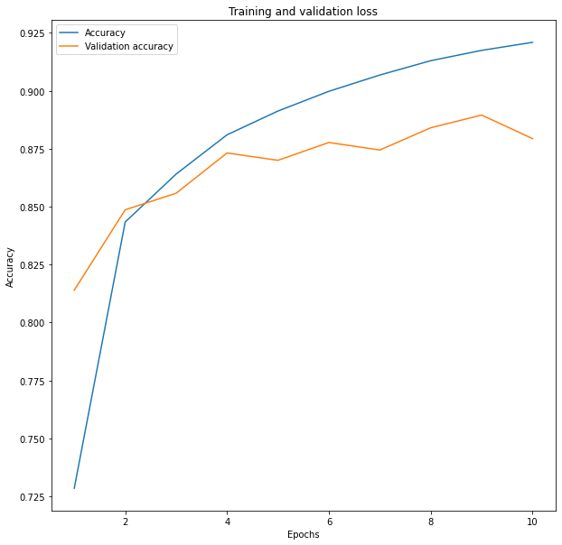
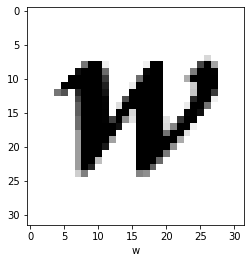
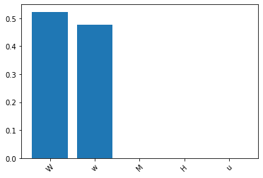

# 1. Introduction

In this project, I used a convolutional neural network to classify english character images.

The dataset I used come from http://www.ee.surrey.ac.uk/CVSSP/demos/chars74k/.

And I used EnglishFnt.tgz data set specifically for this project.

I was trying to develop a OCR system for the characters in the English language, and this convolutional neural network can help classify the characters in the image.

# 2. Algorithm

The algorithm I use is traditional convolutional neural network.

The input image is a 32x32 pixel image.

The first layer is a 3x3 convolutional layer with 32 filters. This produce 32 30x30 images since I'm not using any padding.

And then I shrink the image to 15x15 pixels by using a 2x2 max pooling layer.

The second layer is another 3x3 convolutional layer with 64 filters. This produce 64 13x13 images.

This layer followed by a 2x2 max pooling layer.

And the last convolutional layer is a 3x3 convolutional layer with 64 filters.

Now, there are 64 4x4 images. Which is 1024 features after flattening.

For the fully connected layer, I used a traditional neural network with 1024 inputs and 62 outputs.

Between the input and output, I added a hidden layer with 64 units.

# 3.Dataset

During the preprocess state, I first construct the class names and labels for the dataset.

Then, I shuffle and split the dataset into training and testing dataset. In this project, I used 80% of the dataset for training and 20% for testing.

I tried to use data augmentation to improve the training dataset. But since the original dataset is alread very large (with 62992 images). The data augmentation I used crashes the program. I added 10GB of swap memory, tring to run the prohram, but the data augmentation still takes too long. Finally I decided to use only the original dataset for training.

# 4. Result

The training result is shown below:

It is clear that the overfitting problem occured after around 9 epochs.

However, the overall accuracy on the testing set is around 85%, which is not bad.

An interesting result is that I think the convolutional neural network understand part of the character structure.

Take this character w as an example:

The character W is very similar to the character lower-case w. And the neural network predicted the w as the character W.

This is a mistake that human can also make. Even the neural network failed to recognize this character, it still recognized the similarity between the two characters.

# References and attributions

This project is based on CNN tutorial from https://www.tensorflow.org/tutorials/images/cnn